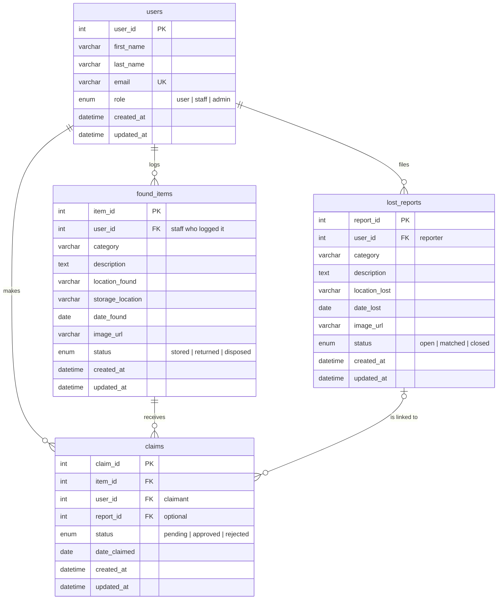

# Group 4: Campus Lost-and-Found System

ITS122P - AM2
Group Members:

- Samuela Ysebelle Adame
- Kervin Del Rosario
- Mariah Kate Guiang
- Kendrick Sebastian

## Problem Statement

Mapua University utilizes a manual and traditional paper and pen logbook for
lost items. An item is turned in to the lost and found office. Written into a
logbook and shoved in a drawer. A student who loses something must physically
visit the office and describe the item or look at the displayed casing.

## Target Users

- Students and Faculty
- Security and Maintenance staff
- Office Administrators

## Proposed Features

- Secure user registration and role-based access
- List item reporting form
- Found item intake logging with physical storage tracking
- Ownership verification

## User Roles

| Role (DB value) | Label in the app         | Can do                                                        |
|-----------------|--------------------------|---------------------------------------------------------------|
| `user`          | Student / Faculty        | Browse found items, file lost reports, submit ownership claims|
| `staff`         | Security & Maintenance   | Everything above + log found items, review claims, hand over  |
| `admin`         | Office Administrator     | Everything above + manage users and roles, view statistics    |

New registrations always start as **Student / Faculty**; an administrator promotes accounts.

## System Architecture

- Responsive Web UI
- User Authentication
- Relational Database

## Tech Stack

- Frontend: Blade templates and Tailwind CSS
- Backend: PHP with the Laravel Framework
- Database: MySQL

## Project Structure

```text
CLAFS/
├── api/                    # JSON endpoints called from public/js/api.js
│   ├── get_items.php       # GET  list found items / lost reports (filters, sort, role-aware fields) — powers the live search
│   ├── add_item.php        # POST validate + insert a found item or lost report; multipart "photo" saved to public/uploads
│   ├── update_item.php     # POST edit a found item / lost report (optionally replace the photo)
│   ├── update_status.php   # POST change a found item's / lost report's status; match a report to an item
│   ├── claims.php          # POST create / review (approve, reject) / withdraw an ownership claim
│   └── update_user.php     # POST admin: change a user's role, deactivate / reactivate
├── config/
│   └── db_connect.php      # App core: constants, PDO connection, helpers, session auth, data layer
│   └── db_connect.local.php  (git-ignored) per-machine DB_* overrides
├── docs/
│   ├── API_Documentation.docx  # Phase 3 API notes: APIs used, purpose, endpoints, data, integration
│   ├── schema.sql          # MySQL tables (ERD) + UI-required additions + seed rows
│   └── erd.html            # Mermaid.js ERD
├── includes/
│   ├── header.php          # <head>, opens <main>, flash message
│   ├── navbar.php          # role-aware navigation
│   └── footer.php          # footer, scripts
├── public/
│   ├── css/styles.css
│   ├── js/app.js           # nav, validation, image preview, table filter, live search, API-backed forms, holiday widget
│   ├── js/api.js           # fetch() wrappers for api/ and for the Nager.Date public-holiday API
│   ├── images/             # static icons and logos
│   └── uploads/            # user-uploaded item photos (git-ignored)
├── index.php               # Homepage + login/register (guests) · tabbed dashboard (users, staff, admin)
├── report.php              # Report a lost item / log a found item; ?id= edits
├── browse.php              # Found items (public) · ?type=lost lost reports (staff) · ?manage=1 inventory (staff)
└── view_item.php           # Item / report detail, ownership claims, staff review and hand-over
```

### Running locally

1. Create the database (drops and recreates the tables, then seeds test rows). Make sure MySQL is
   started in the XAMPP Control Panel first.

   PowerShell (the default terminal in VS Code — `<` does not work there, so pipe the file in):

   ```powershell
   Get-Content docs/schema.sql -Raw | C:\xampp\mysql\bin\mysql.exe -u root
   ```

   Command Prompt or Git Bash:

   ```bash
   C:\xampp\mysql\bin\mysql.exe -u root < docs/schema.sql
   ```

2. If your MySQL is not `root` with no password on `127.0.0.1:3306`, create `config/db_connect.local.php`:

   ```php
   <?php
   define('DB_PASS', 'your-password');   // any of DB_HOST, DB_PORT, DB_NAME, DB_USER, DB_PASS
   ```

3. Start the server and open <http://localhost:8000>:

   ```bash
   C:\xampp\php\php.exe -S localhost:8000 -t .
   ```

Seeded accounts (password for all: `password123`):

| Email                          | Role                   |
|--------------------------------|------------------------|
| `admin@mapua.edu.ph`           | Office Administrator   |
| `staff@mapua.edu.ph`           | Security & Maintenance |
| `student1@mymail.mapua.edu.ph` | Student / Faculty      |

Registration is open to `@mymail.mapua.edu.ph` and `@mapua.edu.ph` addresses.

### What is wired up

- Login, registration, logout and "keep me logged in" — plain PHP form handling in `index.php`, PHP sessions
- Creating and editing lost reports and found items with a photo (`api/add_item.php`, `api/update_item.php`)
- Live search on Found Items — results are fetched from `api/get_items.php` as you type, no reload
- Changing item / report status and matching a report to an item (`api/update_status.php`)
- Submitting, approving/rejecting and withdrawing claims, and the hand-over step (`api/claims.php`, `api/update_status.php`)
- Admin role changes and account deactivation (`api/update_user.php`)
- Next office closure from the external Nager.Date public-holiday API (landing page and item pickup details)
- Every page reads from MySQL

The `api/` files are PHP endpoints that return JSON; `public/js/api.js` is the browser client that calls
them with `fetch()`, and `app.js` updates the page in place from the response. The endpoints accept ordinary
form fields too, so any page could post to them directly. Full notes: `docs/API_Documentation.docx`.

## ERD

Interactive version: [docs/erd.html](docs/erd.html). Created by [docs/schema.sql](docs/schema.sql).



The front-end also uses a few columns not in the diagram (`item_name`, `matched_item_id`, `private_details`,
`proof_description`, `review_*`, `is_active`, `password_hash`); they are added in a separate,
removable section of `schema.sql` until the group decides whether to adopt them into the ERD.
