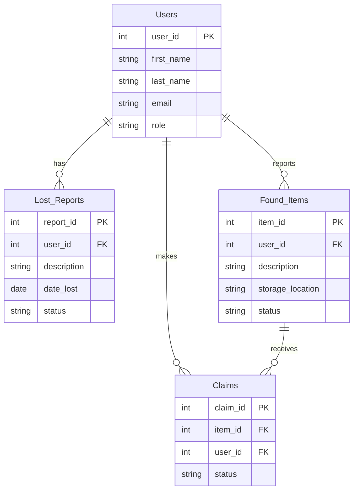

# Group 4: Campus Lost-and-Found System

ITS122P - AM2
Group Members:

- Samuela Ysebelle Adame
- Kervin Del Rosario
- Mariah Kate Guiang
- Kendrick Sebastian

## Problem Statement

Mapua University utilizes a manual and traditional paper and pen logbook for
lost items. An item is turned in to the lost and found office. Written into a
logbook and shoved in a drawer. A student who loses something must physically
visit the office and describe the item or look at the displayed casing.

## Target Users

- Students and Faculty
- Security and Maintenance staff
- Office Administrators

## Proposed Features

- Secure user registration and role-based access
- List item reporting form
- Found item intake logging with physical storage tracking
- Ownership verification

## User Roles

- Administrator
- Staff/Employee
- Customer/User

## System Architecture

- Responsive Web UI
- User Authentication
- Relational Database

## Tech Stack

- Frontend: Blade templates and Tailwind CSS
- Backend: PHP with the Laravel Framework
- Database: MySQL

## Project Structure

```
CLAFS/
├── api/                    # JSON endpoints called from public/js/api.js
│   ├── get_items.php       # GET  list found items / lost reports (filters, role-aware fields)
│   ├── add_item.php        # POST validate + create a found item or lost report
│   └── update_status.php   # POST change a found item's / lost report's status
├── config/
│   └── db_connect.php      # App core: constants, DB settings + db(), helpers, auth stub, data layer
├── docs/
│   ├── schema.sql          # MySQL tables (ERD) + UI-required additions + seed rows
│   └── erd.html            # Mermaid.js ERD
├── includes/
│   ├── header.php          # <head>, opens <main>, flash message
│   ├── navbar.php          # role-aware navigation
│   └── footer.php          # footer, preview role switcher, scripts
├── public/
│   ├── css/styles.css
│   ├── js/app.js           # nav, validation, image preview, table filter, API-backed forms
│   ├── js/api.js           # fetch() wrappers for api/
│   ├── images/             # static icons and logos
│   └── uploads/            # user-uploaded item photos (git-ignored)
├── index.php               # Homepage + login/register (guests) · tabbed dashboard (users, staff, admin)
├── report.php              # Report a lost item / log a found item; ?id= edits
├── browse.php              # Found items (public) · ?type=lost lost reports (staff) · ?manage=1 inventory (staff)
└── view_item.php           # Item / report detail, ownership claims, staff review and hand-over
```

### Running locally

```bash
C:\xampp\php\php.exe -S localhost:8000 -t .
```

Then open <http://localhost:8000>. Until real login exists, use the **Preview as** bar at the bottom
of every page to switch between guest, user, staff and admin. The database is not connected yet;
create it with `docs/schema.sql` when the backend phase starts.

## Initial ERD


